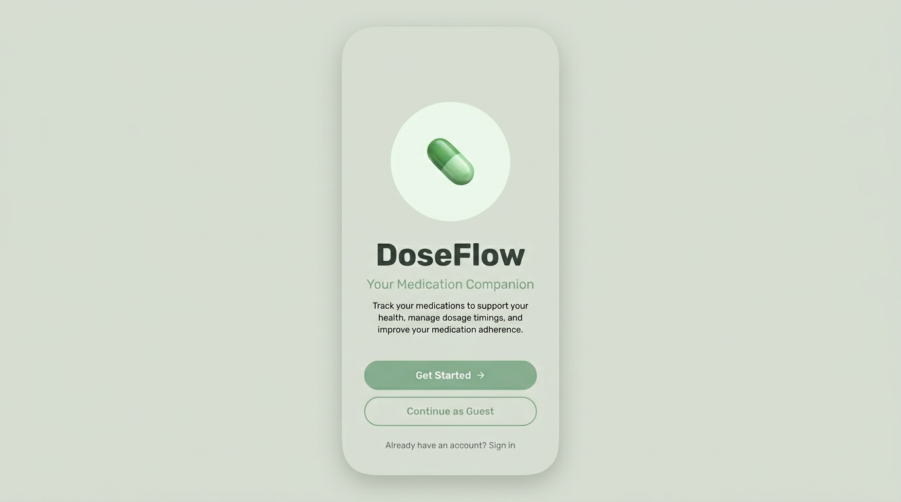
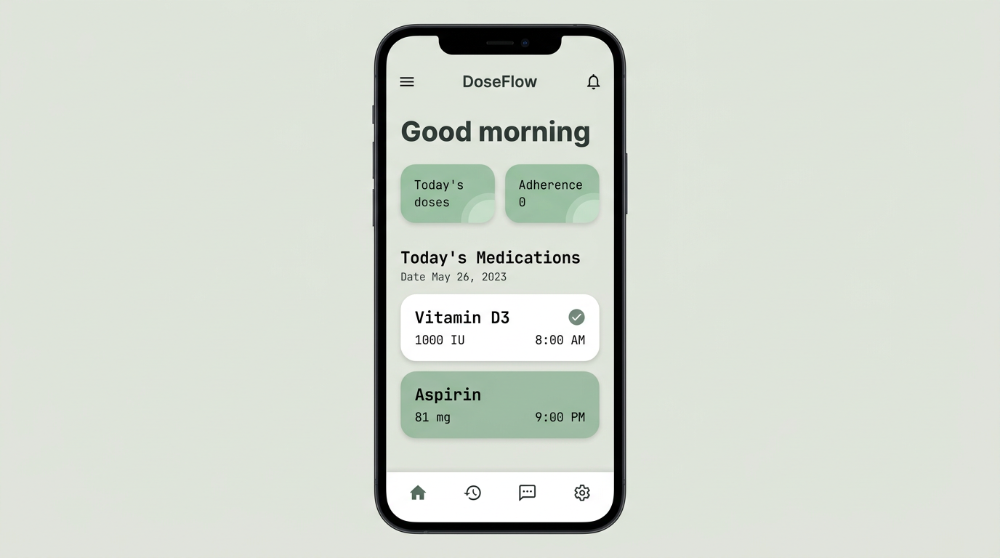
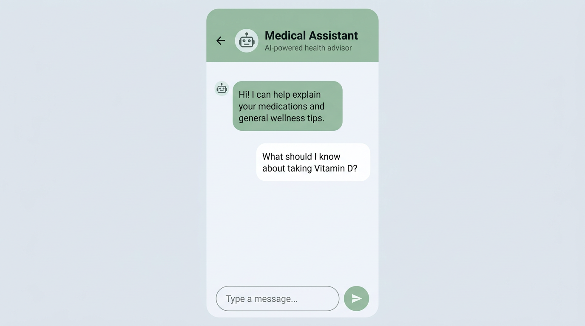

# DoseFlow

**Your medication companion for Android** — schedule doses, log adherence, and stay informed with reminders and an optional AI health assistant.

[](https://kotlinlang.org/)
[](https://developer.android.com/jetpack/compose)
[](https://developer.android.com/)

---

## Overview

DoseFlow helps people manage multiple medications in one place: add medicines with dosage and timing, see what is due today, log doses as taken or skipped, review history, and get timely notifications. The app supports signed-in users (Firebase Authentication), **guest mode** for trying the app without an account, and a **Medical Assistant** chat powered by the Google Gemini API for general medication and wellness questions (not a substitute for professional medical advice).

---

## Screenshots

*Theme-aligned previews (sage `#E0E4DB`, accent `#99C2A2`, text `#343E3D`). Swap in emulator or device captures for store-ready assets.*

| Welcome & onboarding | Home & today’s schedule | Medical assistant (Gemini) |
| :---: | :---: | :---: |
|  |  |  |

---

## Features

- **Medication list** — Add, edit, and remove medicines with dosage, form, and schedule metadata (Room persistence).
- **Today-focused home** — Greeting, quick stats, and “Today’s Medications” with swipe actions where supported.
- **Dose logging** — Mark doses taken or skipped and keep a chronological history.
- **Notifications** — Channels and scheduling for dose reminders (exact behavior depends on device settings and permissions).
- **Authentication** — Email/password flows via Firebase Auth plus **Continue as Guest** for quick access.
- **Medical Assistant** — Chat UI backed by Gemini for educational prompts; requires a valid API key at build time.

---

## Tech stack

| Area | Choices |
|------|-----------|
| UI | Jetpack Compose, Material 3, adaptive layouts (`material3-window-size-class`) |
| Architecture | ViewModel, Navigation Compose, Hilt (DI) |
| Data | Room, Kotlin Serialization, SharedPreferences for session flags |
| Backend services | Firebase Auth, Google Services; Generative AI client for Gemini |
| Networking | Retrofit (where remote APIs are used) |

---

## Requirements

- **Android Studio** with **Android SDK 35** (matches `compileSdk` / AGP **8.13**).
- **JDK 17 or 21** for the Gradle daemon (AGP does not support **JDK 25** yet). Easiest fix: set the Gradle JDK in Android Studio to the bundled 17/21, or install Temurin 21 and point `JAVA_HOME` at it.
- Device or emulator **API 24+**.

---

## Setup

1. **Clone** this repository.

2. Create or edit **`local.properties`** at the project root (this file is local-only and must not be committed):

   ```properties
   sdk.dir=/path/to/Android/Sdk
   API_KEY=your_google_ai_studio_gemini_api_key
   ```

   `API_KEY` is injected into `BuildConfig` for the Gemini client (`GeminiService`). Without it, builds that evaluate `BuildConfig` for that module may fail or the assistant feature will not function at runtime.

3. **Firebase** — The app expects a configured Firebase project (e.g. `google-services.json` under `app/`). Use your own Firebase project for new installs.

4. **Build a debug APK**

   ```bash
   ./gradlew :app:assembleDebug
   ```

5. **Install on a connected device**

   ```bash
   ./gradlew :app:installDebug
   ```

   Or run the **`app`** configuration from Android Studio.

---

## Project layout (high level)

```
app/src/main/java/com/vasant/pillpal/
├── ui/              # Compose screens, navigation, components, theme
├── data/            # Room, API models, DI modules
├── repository/      # Auth and medicine repositories
├── services/        # Notifications, Gemini
└── PilPallApp.kt    # @HiltAndroidApp DoseFlowApp, notification channels, DoseFlow() root
```

- **Gradle root** (`settings.gradle.kts`): `rootProject.name = "PillPal"`, module `:app`, plus the [Foojay toolchains resolver](https://github.com/gradle/foojay-distributions) convention plugin for JVM toolchain downloads when you add toolchain blocks in Gradle.
- **Product name** in the launcher: **DoseFlow** (`app_name` in `strings.xml`). **ApplicationId**: `com.vasant.pillpal`.

---

## Roadmap ideas

Refill reminders, caregiver mode, exportable adherence reports, inventory counts, and drug-interaction checks (would require a regulated data provider) are natural extensions beyond the current codebase.

---

## Disclaimer

DoseFlow and the in-app **Medical Assistant** are for organization and general information only. They **do not** provide medical diagnosis or treatment advice. Always follow your clinician’s instructions and local regulations for medications.
